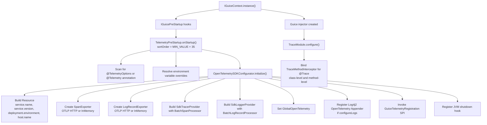
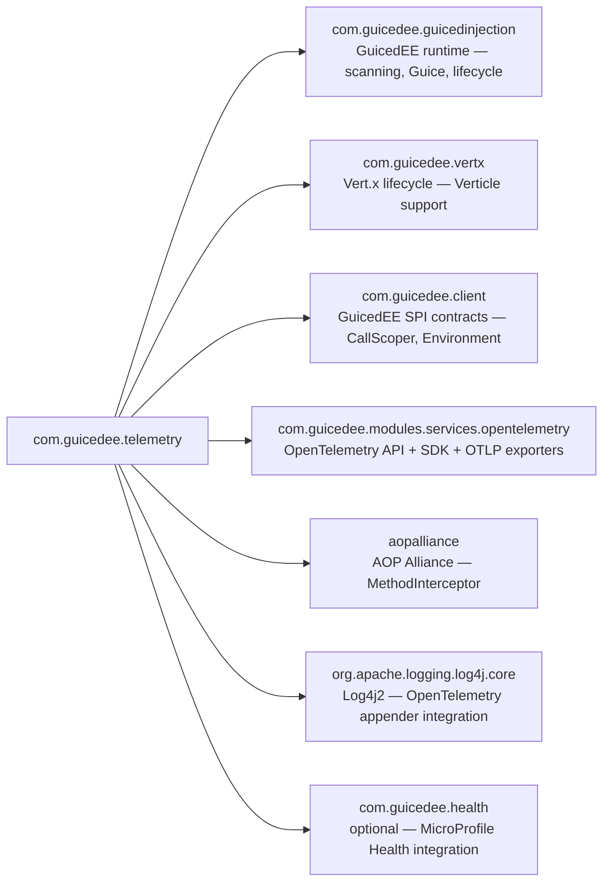

# GuicedEE Telemetry

[](https://github.com/GuicedEE/GuicedTelemetry/actions/workflows/build.yml)
[](https://central.sonatype.com/artifact/com.guicedee/guiced-telemetry)
[](https://github.com/GuicedEE/Packages/packages/maven/com.guicedee.guiced-telemetry)
[](https://www.apache.org/licenses/LICENSE-2.0)


**OpenTelemetry distributed tracing** for [GuicedEE](https://github.com/GuicedEE) applications using **Guice AOP** and **OTLP exporters**.
Annotate your classes and methods with `@Trace` and `@SpanAttribute` — the framework builds an `OpenTelemetrySdk` at startup, binds a `TraceMethodInterceptor` via Guice AOP, and exports spans and logs to any OTLP-compatible backend (Tempo, Jaeger, etc.) automatically.

Built on [OpenTelemetry SDK](https://opentelemetry.io/docs/languages/java/) · [Vert.x](https://vertx.io/) · [Google Guice](https://github.com/google/guice) · [Log4j2](https://logging.apache.org/log4j/2.x/) · JPMS module `com.guicedee.telemetry` · Java 25+

## 📦 Installation

```xml
<dependency>
  <groupId>com.guicedee</groupId>
  <artifactId>guiced-telemetry</artifactId>
</dependency>
```

<details>
<summary>Gradle (Kotlin DSL)</summary>

```kotlin
implementation("com.guicedee:guiced-telemetry:2.0.1-SNAPSHOT")
```
</details>

## ✨ Features

- **`@Trace` annotation** — annotate a class (all methods) or individual methods to create OpenTelemetry spans via Guice AOP interception
- **`@SpanAttribute` annotation** — annotate method parameters to record them as span attributes, or annotate the method to record the return value
- **Annotation-driven SDK configuration** — `@TelemetryOptions` (or `@Telemetry`) on any class/package configures service name, OTLP endpoint, batch sizes, and more
- **Environment variable overrides** — every `@TelemetryOptions` attribute can be overridden via system properties or environment variables
- **OTLP HTTP export** — spans and log records are exported via `OtlpHttpSpanExporter` and `OtlpHttpLogRecordExporter` to any OTLP endpoint
- **In-memory exporters** — set `useInMemoryExporters = true` for unit testing with `InMemorySpanExporter` and `InMemoryLogRecordExporter`
- **Log4j2 appender** — optional OpenTelemetry Log4j2 appender is auto-registered for correlated log export
- **Uni-aware** — the interceptor detects Mutiny `Uni` return types and defers span completion until the `Uni` resolves
- **Call-scope span propagation** — parent spans are propagated through GuicedEE's `CallScoper` for nested `@Trace` methods
- **SPI extensibility** — implement `GuiceTelemetryRegistration` to customize or wrap the `OpenTelemetry` instance after SDK initialization
- **Graceful shutdown** — a JVM shutdown hook closes the `OpenTelemetrySdk` and flushes pending spans
- **Verticle support** — `GuicedTelemetry` is annotated with `@Verticle` for verticle-scoped deployments

## 🚀 Quick Start

**Step 1** — Configure telemetry with an annotation:

```java
@TelemetryOptions(
    serviceName = "my-service",
    otlpEndpoint = "http://localhost:4318",
    serviceVersion = "1.0.0",
    deploymentEnvironment = "production"
)
public class MyAppConfig {
}
```

**Step 2** — Annotate methods to trace:

```java
import com.guicedee.telemetry.annotations.Trace;
import com.guicedee.telemetry.annotations.SpanAttribute;

public class OrderService {

    @Trace("place-order")
    public void placeOrder(@SpanAttribute("order.id") String orderId,
                           @SpanAttribute("order.amount") double amount) {
        // ... business logic — a span is created automatically
    }

    @Trace
    @SpanAttribute("result")
    public String processPayment(String paymentId) {
        // span named "OrderService.processPayment"
        // return value recorded as "result" attribute
        return "success";
    }
}
```

**Step 3** — Bootstrap GuicedEE (tracing starts automatically):

```java
IGuiceContext.registerModuleForScanning.add("my.app");
IGuiceContext.instance();
// All @Trace methods are intercepted and spans are exported
```

No JPMS `provides` declarations are needed for consuming code — the module is registered automatically via its own service providers.

## 📐 Startup Flow



## 🔍 Tracing Annotations

### `@Trace`

Creates an OpenTelemetry span around a method invocation:

```java
// Custom span name
@Trace("fetch-users")
public List<User> fetchUsers() { ... }

// Default span name: "UserService.fetchUsers"
@Trace
public List<User> fetchUsers() { ... }
```

When placed on a **class**, all methods in that class are traced:

```java
@Trace("user-operations")
public class UserService {
    public void create() { ... }  // span: "user-operations"
    public void delete() { ... }  // span: "user-operations"
}
```

### `@SpanAttribute`

Records method parameters or return values as span attributes:

```java
@Trace
public void process(
    @SpanAttribute("input.id") String id,       // recorded as attribute
    @SpanAttribute("input.count") int count) {   // recorded as attribute
    // ...
}

@Trace
@SpanAttribute("output")   // return value recorded as "output" attribute
public String compute() {
    return "result";
}
```

Supported types: `String`, `Boolean`, `Long`, `Double`, `Integer`, `Float`. Complex objects are serialized to JSON via Jackson.

### Uni support

When a `@Trace` method returns a Mutiny `Uni`, the span is kept open until the `Uni` completes or fails:

```java
@Trace("async-operation")
public Uni<String> fetchAsync(@SpanAttribute("key") String key) {
    return Uni.createFrom().item(() -> doWork(key));
}
// Span ends when the Uni emits an item or failure
```

### Span propagation

Parent spans are propagated through GuicedEE's `CallScoper`. When nested `@Trace` methods are called within the same call scope, child spans are linked to the parent automatically.

## ⚙️ Configuration

### `@TelemetryOptions` annotation

Place `@TelemetryOptions` on any class or package to configure the OpenTelemetry SDK:

```java
@TelemetryOptions(
    enabled = true,
    serviceName = "my-service",
    otlpEndpoint = "http://localhost:4318",
    useInMemoryExporters = false,
    configureLogs = true,
    serviceVersion = "1.0.0",
    deploymentEnvironment = "production",
    maxBatchSize = 512,
    maxLogBatchSize = 512,
    logSignals = false
)
public class MyAppConfig {
}
```

| Attribute | Default | Description |
|---|---|---|
| `enabled` | `true` | Enable or disable telemetry entirely |
| `serviceName` | `"GuicedEE-Application"` | `service.name` resource attribute |
| `otlpEndpoint` | `"http://localhost:4317"` | OTLP exporter endpoint |
| `useInMemoryExporters` | `false` | Use in-memory exporters for testing |
| `configureLogs` | `true` | Auto-register the OpenTelemetry Log4j2 appender |
| `serviceVersion` | `"1.0.0"` | `service.version` resource attribute |
| `deploymentEnvironment` | `"production"` | `deployment.environment` resource attribute |
| `maxBatchSize` | `512` | Max spans per batch export |
| `maxLogBatchSize` | `512` | Max log records per batch export |
| `logSignals` | `false` | Enable OTel internal signal logging |

### `@Telemetry` annotation (alternative)

The `@Telemetry` annotation provides the same configuration options as `@TelemetryOptions` and can be used interchangeably. `@TelemetryOptions` takes priority when both are present.

### Environment variable overrides

Every attribute can be overridden with a system property or environment variable:

| Variable | Overrides | Example |
|---|---|---|
| `TELEMETRY_ENABLED` | `enabled` | `false` |
| `TELEMETRY_SERVICE_NAME` | `serviceName` | `order-service` |
| `TELEMETRY_OTLP_ENDPOINT` | `otlpEndpoint` | `http://tempo:4318` |
| `TELEMETRY_USE_IN_MEMORY` | `useInMemoryExporters` | `true` |
| `TELEMETRY_CONFIGURE_LOGS` | `configureLogs` | `false` |
| `TELEMETRY_SERVICE_VERSION` | `serviceVersion` | `2.0.1-SNAPSHOT` |
| `TELEMETRY_DEPLOYMENT_ENVIRONMENT` | `deploymentEnvironment` | `staging` |
| `TELEMETRY_MAX_BATCH_SIZE` | `maxBatchSize` | `1024` |
| `TELEMETRY_MAX_LOG_BATCH_SIZE` | `maxLogBatchSize` | `1024` |
| `TELEMETRY_LOG_SIGNALS` | `logSignals` | `true` |
| `OTEL_EXPORTER_OTLP_ENDPOINT` | OTLP endpoint (standard OTel) | `http://tempo:4318` |
| `HOSTNAME` | `host.name` resource attribute | `prod-node-1` |

Environment variables take precedence over annotation values.

## 🧪 Testing

Use in-memory exporters to verify spans in unit tests:

```java
@TelemetryOptions(
    enabled = true,
    useInMemoryExporters = true,
    configureLogs = false
)
public class MyTestConfig {
}
```

```java
import io.opentelemetry.sdk.testing.exporter.InMemorySpanExporter;

@Test
void testTracing() {
    IGuiceContext.instance().inject();

    TracedService service = IGuiceContext.get(TracedService.class);
    service.tracedMethod();

    InMemorySpanExporter exporter = OpenTelemetrySDKConfigurator.getInMemorySpanExporter();
    var spans = exporter.getFinishedSpanItems();
    assertTrue(spans.stream().anyMatch(s -> s.getName().equals("TracedService.tracedMethod")));
}
```

Call `OpenTelemetrySDKConfigurator.reset()` in `@AfterEach` to clean up between tests.

## 🔌 SPI Extension Point

Implement `GuiceTelemetryRegistration` to customize the `OpenTelemetry` instance after SDK initialization:

```java
public class MyTelemetryRegistration
        implements GuiceTelemetryRegistration<MyTelemetryRegistration> {

    @Override
    public OpenTelemetry configure(OpenTelemetry openTelemetry) {
        // Wrap, decorate, or replace the instance
        return openTelemetry;
    }
}
```

Register via JPMS:

```java
module my.app {
    requires com.guicedee.telemetry;

    provides com.guicedee.telemetry.spi.GuiceTelemetryRegistration
        with my.app.MyTelemetryRegistration;
}
```

A default no-op `DefaultTelemetryRegistration` is provided. Custom implementations are discovered via `ServiceLoader` and invoked in order.

## 📊 Observability Stack (Docker Compose)

A `docker-compose.yaml` and `docker/` directory are provided for a local observability stack:

```bash
docker-compose up -d
```

This starts:

| Service | Port | Purpose |
|---|---|---|
| **Grafana Tempo** | `3200` (HTTP), `4317` (gRPC OTLP), `4318` (HTTP OTLP) | Distributed trace storage |
| **Prometheus** | `9090` | Metrics scraping |
| **Graphite** | `8080` (Web UI), `2003` (pickle) | Metrics storage |
| **Grafana** | `3000` | Dashboard visualization (login: `admin`/`admin`) |

### Grafana setup

1. Login to Grafana at `http://localhost:3000`
2. Add **Tempo** data source with URL `http://tempo:3200`
3. Add **Prometheus** data source with URL `http://prometheus:9090`
4. Explore traces and correlate with logs

### Tempo configuration

The included `docker/tempo.yaml` configures:
- OTLP (HTTP + gRPC), Zipkin, and Jaeger receivers
- 5-minute head block duration
- 1-hour trace retention
- Metrics generator with Prometheus external labels

## 🗺️ Module Graph



## 🧩 JPMS

Module name: **`com.guicedee.telemetry`**

The module:
- **exports** `com.guicedee.telemetry`, `com.guicedee.telemetry.annotations`, `com.guicedee.telemetry.spi`, `com.guicedee.telemetry.implementations`, `com.guicedee.telemetry.interceptors`
- **provides** `IGuiceModule` with `TraceModule`
- **provides** `IGuicePreStartup` with `TelemetryPreStartup`
- **provides** `IGuiceScanModuleInclusions` with `GuiceTelemetryModuleInclusions`
- **provides** `GuiceTelemetryRegistration` with `DefaultTelemetryRegistration`
- **uses** `GuiceTelemetryRegistration` (SPI for custom SDK customization)
- **requires static** `com.guicedee.health` (optional)

## 🏗️ Key Classes

| Class | Role |
|---|---|
| `TelemetryOptions` | Annotation — configures service name, OTLP endpoint, batch sizes, in-memory mode |
| `Telemetry` | Annotation — alternative configuration annotation (same options) |
| `Trace` | Annotation — marks classes/methods for span creation via Guice AOP |
| `SpanAttribute` | Annotation — records method parameters or return values as span attributes |
| `TelemetryPreStartup` | `IGuicePreStartup` — scans for config annotations, resolves env overrides, initializes SDK |
| `OpenTelemetrySDKConfigurator` | Builds `OpenTelemetrySdk` with tracer/logger providers, exporters, and resource attributes |
| `TraceModule` | `IGuiceModule` — binds `TraceMethodInterceptor` for `@Trace` via Guice AOP |
| `TraceMethodInterceptor` | `MethodInterceptor` — creates spans, records attributes, handles Uni return types |
| `GuiceTelemetryRegistration` | SPI — customize or wrap the `OpenTelemetry` instance |
| `DefaultTelemetryRegistration` | Default no-op SPI implementation |
| `GuiceTelemetryModuleInclusions` | `IGuiceScanModuleInclusions` — ensures the telemetry module is scanned |
| `GuicedTelemetry` | `@Verticle` marker class for verticle-scoped deployment |

## 🤝 Contributing

Issues and pull requests are welcome — please add tests for new interceptors or SDK configurations.

## 📄 License

[Apache 2.0](https://www.apache.org/licenses/LICENSE-2.0)
